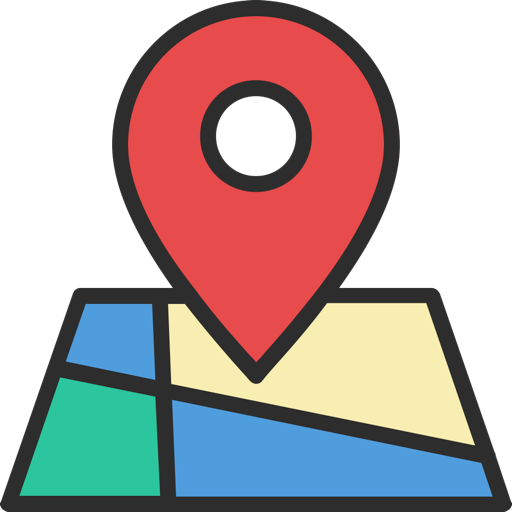
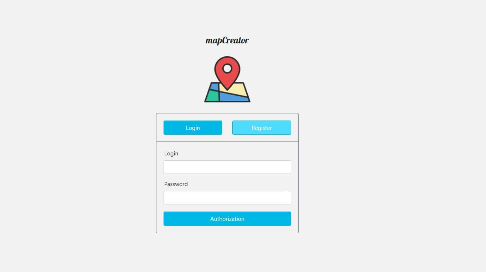
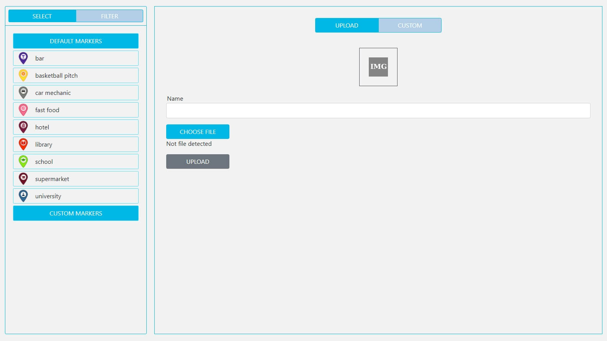
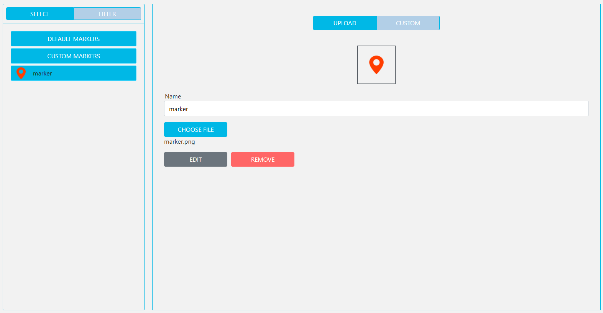
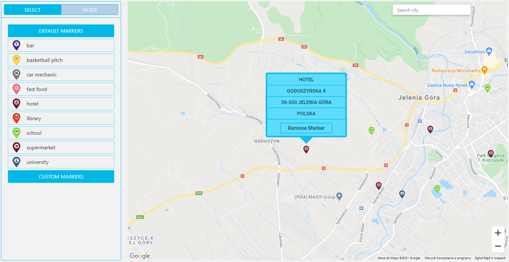
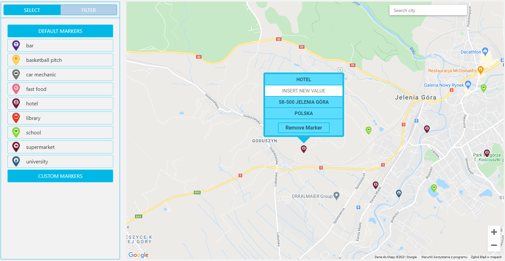
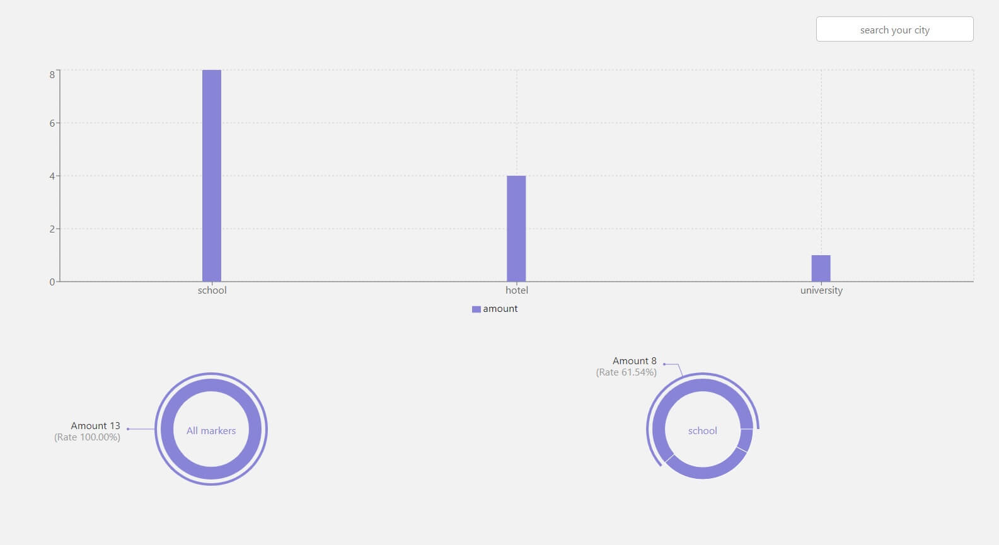
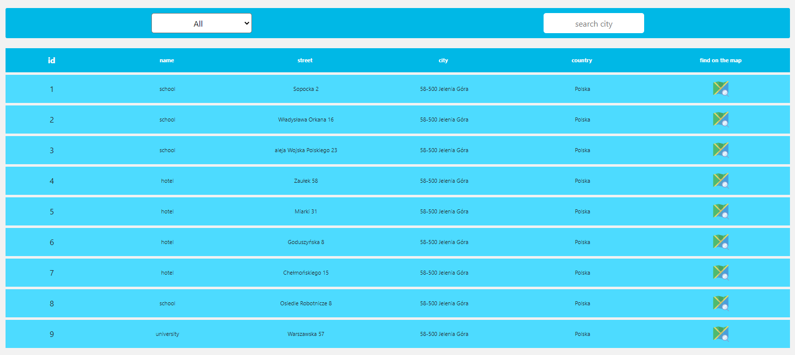
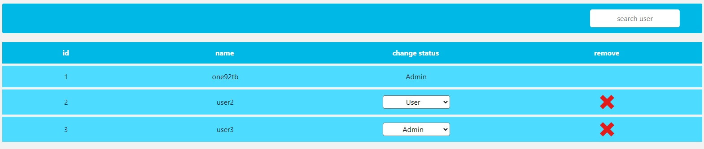

# mapCreator


## Table of contents
* [General info](#general-info)
* [Setup](#setup)
* [Technologies](#technologies)
* [Features](#features)
* [Status](#status)
* [Hostring](#hostring)
* [Licence](#licence)

## General info 

This is application that uses react-google-map package, written in React library. It allows us to create markers on the user panel. After that marker can be putted on the map as an indicator. Indicators are editable and removable. User can also check data from indicator using a indicator table or indicator charts. Application has additional feature for administrators. They can change user status from user to admin or and vice versa.

## Setup

To run this project, install it locally using npm:
```
$ cd mapCreatorClient
$ npm install
$ npm start
```
## Features
- User authorization

- Create marker

- Edit/remove marker

- Add own/default markers on the map as indicators

- Edit or update indicators

- See indicators on the charts

- Check indicators on the table and redirect to the map

- Manage user status (only for administrators)


## Technologies

Project is created with:
- [ReactJS](https://pl.reactjs.org/)
- [Redux](https://redux.js.org/)
- [react-google-maps/api](https://react-google-maps-api-docs.netlify.app/)
- [geocode](https://developers.google.com/maps/documentation/geocoding/overview)
- [styled-components](https://styled-components.com/)
- [react router](https://reactrouter.com/)

## Status
Project is: _in progress_

## Hosting

Project is avaliable on [heroku](https://map-creator-client.herokuapp.com/)

## Licence
MIT - Free Software